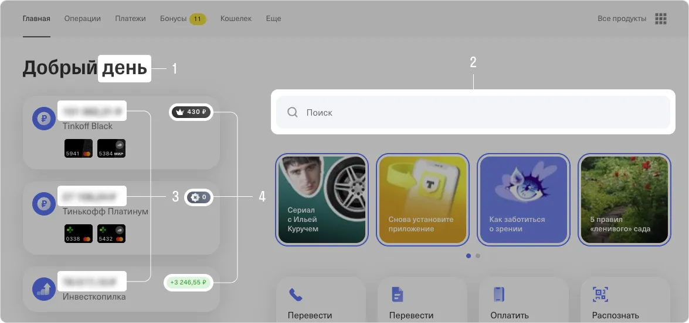

# Проект "Анализ транзакций"
## Описание. 
   Приложение будет генерировать JSON-данные для веб-страниц, формировать отчеты,
   а также предоставлять другие сервисы.
   
## Требования к окружению
  На вашем компьютере должна быть установлена следующая версия Python:
    ```
     Python 3.12.7+
    ```
## Установка проекта 
  - Склонировать репозиторий. Для этого набрать следующую команду:
    ```
    git clone https://github.com/ElenaFilipeva70/cource_Project_1
    ```
  - Перейти в директорию проекта:
    ```
    cd cource_Project_1
    ```
  - Создать и активировать виртуальное окружение:
    ```
    python -m venv .env

    .env\Scripts\activate 
    ```
## Установка зависимостей:
    
    poetry install

## Как запустить проект:
```
    python main.py   
```

## Тестирование функций:

Команда запускается из директории проекта:
```
    pytest 
```

## Использование

В приложении реализованы три основные задачи:
- Веб-страницы: Главная
- Сервисы: Выгодные категории повышенного кешбэка
- Отчеты: Траты по категории  

###### Страница "Главная" 
Реализует набор функций и главную функцию, принимающую на вход
строку с датой и временем в формате *YYYY-MM-DD HH:MM:SS* и возвращающую JSON-ответ
со следующими данными:
```
- Приветствие в формате 
"???", где ??? — «Доброе утро» / «Добрый день» / «Добрый вечер» / «Доброй ночи» 
в зависимости от текущего времени.
- По каждой карте:
последние 4 цифры карты;
общая сумма расходов;
кешбэк (1 рубль на каждые 100 рублей).
- Топ-5 транзакций по сумме платежа.
- Курс валют.
- Стоимость акций из S&P500.
```
Пример структуры JSON-ответа:
```
{
  "greeting": "Добрый день",
  "cards": [
    {
      "last_digits": "5814",
      "total_spent": 1262.00,
      "cashback": 12.62
    },
    {
      "last_digits": "7512",
      "total_spent": 7.94,
      "cashback": 0.08
    }
  ],
  "top_transactions": [
    {
      "date": "21.12.2021",
      "amount": 1198.23,
      "category": "Переводы",
      "description": "Перевод Кредитная карта. ТП 10.2 RUR"
    },
    {
      "date": "20.12.2021",
      "amount": 829.00,
      "category": "Супермаркеты",
      "description": "Лента"
    },
    {
      "date": "20.12.2021",
      "amount": 421.00,
      "category": "Различные товары",
      "description": "Ozon.ru"
    },
    {
      "date": "16.12.2021",
      "amount": -14216.42,
      "category": "ЖКХ",
      "description": "ЖКУ Квартира"
    },
    {
      "date": "16.12.2021",
      "amount": 453.00,
      "category": "Бонусы",
      "description": "Кешбэк за обычные покупки"
    }
  ],
  "currency_rates": [
    {
      "currency": "USD",
      "rate": 73.21
    },
    {
      "currency": "EUR",
      "rate": 87.08
    }
  ],
  "stock_prices": [
    {
      "stock": "AAPL",
      "price": 150.12
    },
    {
      "stock": "AMZN",
      "price": 3173.18
    },
    {
      "stock": "GOOGL",
      "price": 2742.39
    },
    {
      "stock": "MSFT",
      "price": 296.71
    },
    {
      "stock": "TSLA",
      "price": 1007.08
    }
  ]
}
```
Пример использования JSON-ответа на странице: 
!
1. Утро/день/вечер/ночь в зависимости от текущего времени.
2. Поиск по всему Excel-файлу.
3. Остаток по счету.
4. Кешбэк.



Основные функции для генерации JSON-ответов реализованы в отдельном модуле *views.py.*
Данные для анализа и вывода на веб-страницы — это данные с начала месяца, на который выпадает
входящая дата, по входящую дату.
Если дата — 20.05.2020, то данные для анализа будут в диапазоне 01.05.2020-20.05.2020.

Валюты и акции для отображения на веб-страницах задаются в отдельном файле пользовательских
настроек *user_settings.json.*

Пример:
```
{
  "user_currencies": ["USD", "EUR"],
  "user_stocks": ["AAPL", "AMZN", "GOOGL", "MSFT", "TSLA"]
}
```
Для получения данных о валютах и ценах на акции используется библиотеку *requests.* и сервисы:
 - APILayer
 - polygon.io

###### Сервисы
Реализованы Сервисы в отдельном модуле services.py. Позволяет проанализировать, какие категории 
были наиболее выгодными для выбора в качестве категорий повышенного кешбэка. На вход функции 
поступают данные для анализа, год и месяц.

*Входные параметры:* 

data — данные с транзакциями;
year — год, за который проводится анализ;
month — месяц, за который проводится анализ.

*Выходные параметры:* 

JSON с анализом, сколько на каждой категории можно заработать кешбэка в указанном месяце года.

Формат выходных данных:
```
{
    "Категория 1": 1000,
    "Категория 2": 2000,
    "Категория 3": 500
}
```

###### Отчеты
Реализованы Отчеты в отдельном модуле reports.py.
Создан декоратор для функции отчетов. Он записывает в файл результат, который возвращает функция, 
формирующая отчет.

Декоратор без параметра — записывает данные отчета в файл с названием по умолчанию (формат имени 
файла придумайте самостоятельно).
Декоратор с параметром — принимает имя файла в качестве параметра.

В рамках задачи Отчеты реализован функционал "Траты по категории".

Функция принимает на вход:

- датафрейм с транзакциями,
- название категории,
- опциональную дату. Если дата не передана, то берется текущая дата.

Функция возвращает траты по заданной категории за последние три месяца (от переданной даты).

## Лицензия:

Данный проект лицензирован в соответствии с условиями лицензии MIT 